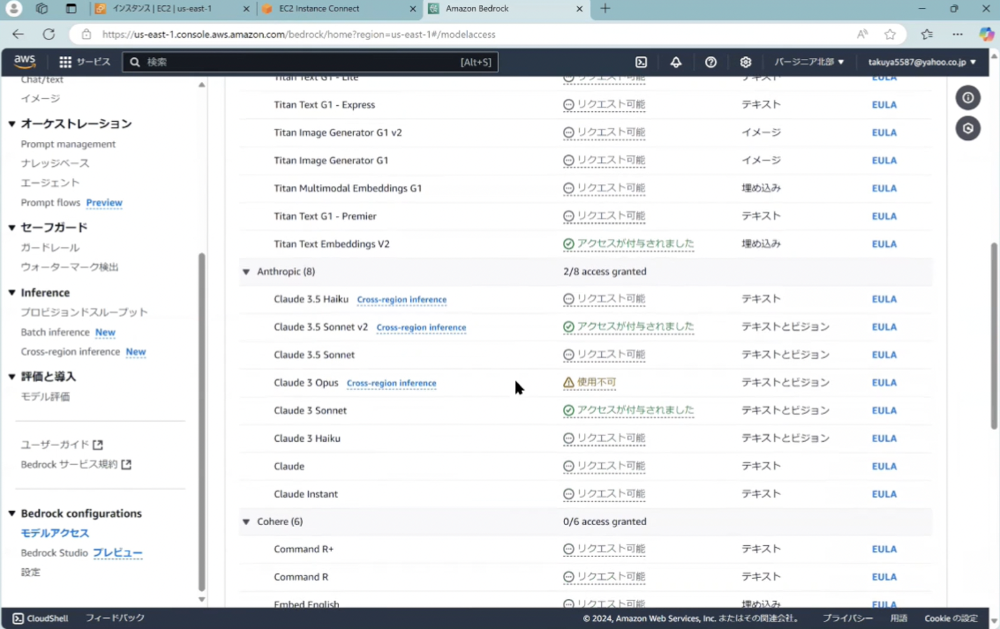

# 1: Create EC2

(Skipped)

# 2: Install middlewares

## Install Git

```zsh
sudo yum update -l
sudo yum install git
```

## Download the environment for GenU

Repo URL: https://github.com/aws-samples/generative-ai-use-cases-jp

```zsh
git clone --branch v2.0.0 https://github.com/aws-samples/generative-ai-use-cases-jp.git
```

## Install Node.js

```zsh
curl -sL https://rpm.nodesource.com/setup_18.x | sudo bash - 
sudo yum install -y nodejs-18.20.2
```

# 3: Modify the configuration files to enable Bedrock

Move to the directory.

```zsh
cd generative-ai-use-cases-jp/
```

Edit `packages/cdk/cdk.json` like the below.

```json
"modelRegion": "us-east-1",
"modelIds": ["anthropic.claude-3-sonnet-20240229-v1:0"],
"imageGenerationModelIds": ["stability.stable-diffusion-xl-v1"],
```

Open Bedrock service on AWS Management Console and enable the target FM (Anthropic Claude 3 Sonnet)



# 4: Initial deployment

- Clean up the dependencies in Nodejs project & install
- CDK boostrap by using AWS CDK
- Start the deployment of AWS CDK project

```zsh
npm ci
npx -w packages/cdk cdk bootstrap
npm run cdk:deploy
```

# 5: Enable RAG

Move to the directory.

```zsh
cd generative-ai-use-cases-jp/
```

- Edit `packages/cdk/cdk.json` like the below.
- `ragKnowledgeBaseStandbyReplicas` controls the redundancy for OpenSearch Serverless.
- `ragKnowledgeBaseAdvancedParsing` controls to extract the unconstructed data such as matrix tables, graphs and etc.

```json
"ragKnowledgeBaseEnabled": true,
"ragKnowledgeBaseStandbyReplicas": false,
"ragKnowledgeBaseAdvancedParsing": false,
"ragKnowledgeBaseAdvancedParsingModelId": "anthropic.claude-3-sonnet-20240229-v1:0",
"embeddingModelId": "amazon.titan-embed-text-v2:0",
```

# 6: Configure Chunk

Move to the directory.

```zsh
cd packages/cdk/lib/rag-knowledge-base-stack.ts
```

Edit the following parameter such like the below.

```ts
  chunkingStrategy: 'SEMANTIC', // SEMANTIC, FIXED_SIZE, HIERARCHICAL are available
```

# 7: Initial deployment

- Re-deploy

```zsh
npm ci
npx -w packages/cdk cdk bootstrap # it's possible to skip this line if you've already run it
npm run cdk:deploy
```

# 8: Sync data sources

- `packages/cdk/rag-docs/docs` will be uploaded to S3 when the deployment occurs.
- So please re-sync docs via Knowledge Base Console after the deployment is completed.
