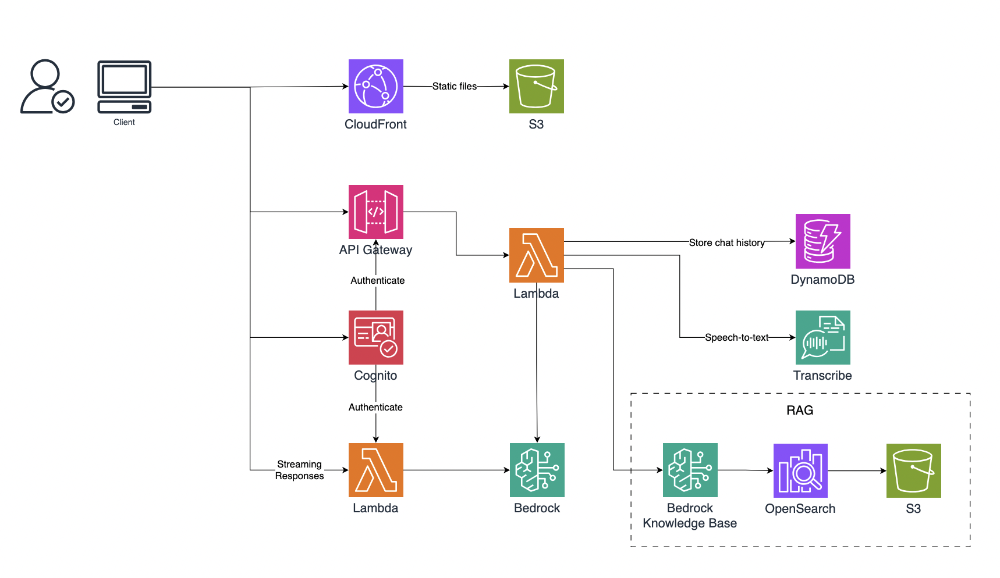
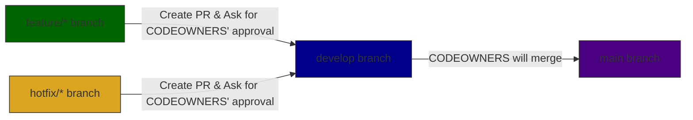

# Welcome to my genU demo app!

This is a demo Generative AI application built with AWS Bedrock managed by @su3-hokkaido

# System Architecture

The original architecture diagram is managed in [this draw.io file](https://drive.google.com/file/d/1oA3hZ8KquFQ9eNOBPBLKT8VCh-ZCQyuA/view?usp=drive_link) which can be accessed by only @su3-hokkaido.

# Branch strategy

## Branch naming convention

- `main` is the production branch
- `develop` is the development branch
- `feature/*` is the feature branch
- `hotfix/*` is the hotfix branch

## Branch protection

- `main` and `develop` are protected branches, please ask @su3-hokkaido to approve your PR before merging to these branches.
- Please checkout a new branch from `develop` for your new feature, and merge your PR to `develop`.
- `main` branch is only allowed to be merged from `develop` branch.
- `main` branch is only allowed to be merged by CODEOWNERS.
- `main` branch is automatically deployed to AWS ECR and ECS.

